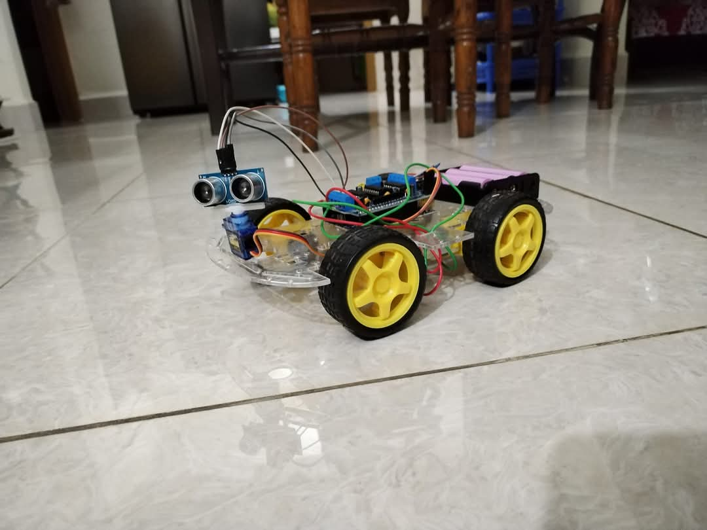

# Obstacle Avoiding Car


**Project Overview**:
This project demonstrates an **Obstacle Avoiding Robot** using an **Arduino** and various sensors. The robot uses an **Ultrasonic Sensor** to detect obstacles in its path. When an obstacle is detected within a certain distance, the robot changes its direction. The robot is equipped with a **Servo Motor** to help it turn, and it uses **DC motors** for movement.


### <h4>Components required in this module:</h4>
<ol>
  <li><p>Arduino</p></li>
  <li><p>Motor Shield L293D</p></li>
  <li><p>Chassis set</p></li>
  <li><p>Ultrasonic Sensor</p></li>
  <li><p>Servo Motor</p></li>
  <li><p>Jumper Wires</p></li>
  <li><p>Double-Sided Tape</p></li>
  <li><p>Batteries </p></li>
  <li><p>PC</p></li>
  <li><p>Arduino Cable</p></li>
</ol>

### System Diagram:


**Figure 1**: The obstacle-avoiding robot setup with an ultrasonic sensor and servo motor. The robot automatically changes direction when an obstacle is detected.

## Working Principle:
The robot continuously checks the distance in front of it using the ultrasonic sensor. If the distance is below a certain threshold (indicating an obstacle), the robot will stop and then turn to avoid the obstacle. The servo motor helps in turning the robot to the left or right. The robot will keep moving forward as long as no obstacles are detected.

### Features:
- **Obstacle Detection**: The ultrasonic sensor measures the distance ahead, and when an obstacle is detected within a specific range, the robot changes its path.
- **Automatic Navigation**: The robot automatically adjusts its direction based on the detected obstacles to avoid collisions.
- **Servo-Controlled Turning**: The robot uses a servo motor to adjust its direction based on the sensor input.

### Code Explanation:
This project uses the following libraries:
- **AFMotor.h** for controlling the DC motors using the Adafruit Motor Shield.
- **Servo.h** for controlling the servo motor.
- **NewPing.h** for handling the ultrasonic sensor and distance measurements.

The robot uses the servo motor to rotate and check the left and right sides for obstacles. If both sides are blocked, it will perform a complete turn around.

### Arduino Code:
```cpp
// Arduino code for obstacle avoiding robot using ultrasonic sensor and motors
// [Include your full Arduino code here, or link to the file]

